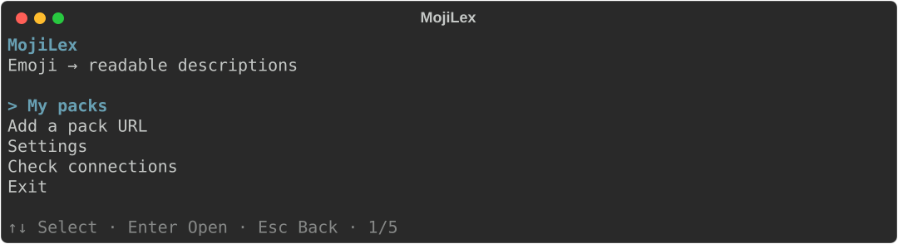
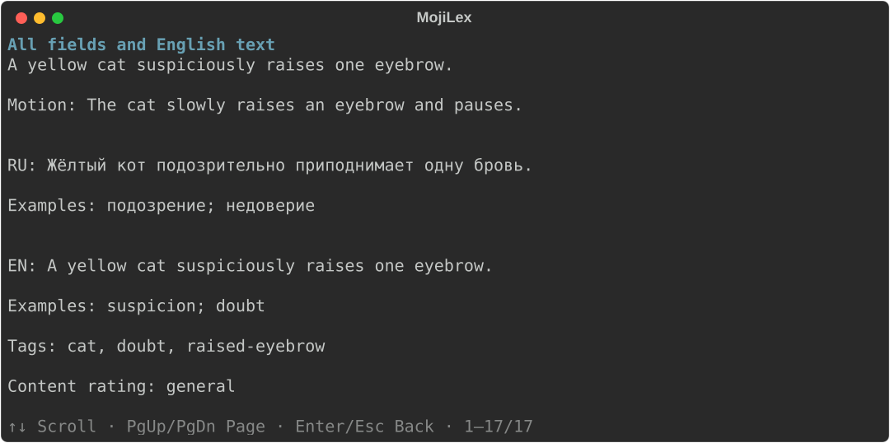

# MojiLex CLI

English | [Русский](README_RU.md)

**Turn Telegram custom emoji into readable Russian and English descriptions.**
Add a pack URL, let AI describe it, browse the results, and optionally contribute
them to the [shared MojiLex dataset](https://github.com/MojiLex/mojilex).

Use the terminal menu with arrow keys. No repository cloning, IDE or internal run IDs required.



[Install](#quick-start) · [First pack](#your-first-pack) ·
[Commands](#everyday-commands) · [Help](#questions-and-troubleshooting)

## Native media platform support

Windows and Linux support isolated media processing when `mojilex doctor` succeeds.
On macOS versions that reject the exact hard worker memory cap, media processing
is unavailable; `doctor` reports this and decoding fails before producing output.
The limit is never raised or disabled automatically. Dataset commands remain
available. See [platform limits and CI coverage](docs/native-media-platforms.md).

## Quick start

### 1. Install the prerequisites

You need **Git** to install MojiLex and work with the dataset, **uv** to manage
the program, and **GitHub CLI (gh)** to submit results. Installation needs internet access.

<details>
<summary><strong>Windows — PowerShell</strong></summary>

Install [Git](https://git-scm.com/install/windows) and [GitHub CLI](https://cli.github.com/)
using their Windows installers. Then install [uv](https://docs.astral.sh/uv/getting-started/installation/):

```powershell
powershell -ExecutionPolicy ByPass -c "irm https://astral.sh/uv/install.ps1 | iex"
```

Close the terminal and open a new PowerShell window.

</details>

<details>
<summary><strong>macOS / Linux</strong></summary>

Install [Git for your OS](https://git-scm.com/install/) and
[GitHub CLI](https://github.com/cli/cli#installation) using their official instructions.
Then install [uv](https://docs.astral.sh/uv/getting-started/installation/):

```sh
curl -LsSf https://astral.sh/uv/install.sh | sh
```

Close the terminal and open a new window.

</details>

### 2. Install MojiLex

These commands work on all supported systems. uv installs Python 3.11 if needed:

```console
uv tool install --python 3.11 "git+https://github.com/MojiLex/mojilex-cli.git@main"
uv tool update-shell
```

Open a new terminal, then run `mojilex --version` to check the installation.
This installs the current main-branch build. MojiLex is an early version;
[report problems here](https://github.com/MojiLex/mojilex-cli/issues).

### 3. Set up once

```console
mojilex --ui-language en init
```

The wizard asks for settings:

- Keep the suggested local dataset path, `gemini` as the provider and `ru,en` as the description languages.
- Enter the exact [Gemini model ID](https://ai.google.dev/gemini-api/docs/models) available to your account. No model is selected automatically.
- You can keep the publication default. The **menu always analyzes locally** and offers sending separately; advanced commands also use this setting.
- If asked for a Git author, enter the name and email to appear on contributions, or skip until publishing.

Already configured? Use `mojilex settings` instead of repeating setup.

By default, MojiLex automatically prepares a local copy of the public dataset in
its per-user application data folder. On Windows this is
`%LOCALAPPDATA%\MojiLex\mojilex\repository`; saved packs and run history remain in
`%LOCALAPPDATA%\MojiLex\mojilex\runs`. No manual clone is needed, and the default
location does not depend on the folder where you start the program. On macOS and
Linux, the operating system's user application state folder is used. Existing
custom repository and run storage settings remain in effect.
The clean default checkout updates from GitHub before use; local edits, commits
and manually selected branches are preserved.

### 4. Add access keys and check the tools

| Access | Where to get it | Used for |
|---|---|---|
| Telegram bot token | [Create a bot with BotFather](https://core.telegram.org/bots/tutorial#obtain-your-bot-token) | Download public emoji packs |
| Gemini API key | [Google AI Studio instructions](https://ai.google.dev/gemini-api/docs/api-key) | Generate descriptions |
| GitHub account | `gh auth login` | Submit results; login is optional for local analysis |

To avoid re-entering keys, save them through hidden input, then check the tools:

```console
mojilex config set-credentials
mojilex doctor
```

Keys go into the operating system's credential store, not Git. Saving is optional:
analysis asks for missing keys for that invocation. `init` never asks for keys.

Follow any missing-component instructions from `doctor`. On Windows it offers
WebM/TGS tool installation; TGS can require administrator approval and a sizeable
Visual Studio Build Tools installation. For Linux/macOS, follow [media prerequisites](docs/media-prerequisites.md).

## Your first pack

```console
mojilex
```

1. Choose **Add packs from a URL or file** and paste a public link, such as `https://t.me/addemoji/NewsEmoji`, or a text file path.
2. Read the analysis plan and cost confirmation; allow requests if you agree.
3. After completion, open **My packs → your pack → Browse descriptions**.
4. Search, switch RU/EN, or open **All fields and English text**.
   **↑↓ / PgUp / PgDn** scroll details; **Enter / Esc** return.
5. For another view, choose **Open browser gallery**.

The menu saves locally and does not submit automatically. Viewing descriptions
or the gallery makes no AI requests. Missing local previews appear as placeholders.

Example details, rendered by the program using sample data:



## Multiple packs from a file

Paste a path such as `C:\Users\Me\Desktop\packs.txt` into the menu. Use one URL
per line in a UTF-8 file. Blank lines, `#` comments and duplicate URLs are ignored.
All URLs share one import and analysis run, with one AI cost approval rather than
one per URL. The configured AI request limit still applies to the entire run.
AI cost and publication confirmations default to **Yes**; Enter accepts it.

**My packs** shows each URL as a separate pack with its own progress, descriptions,
and history. Its card resumes, analyzes, or publishes only that pack. Existing
file imports are supported without deleting or importing them again. The request
counter on a batch pack card belongs to the entire operation; selecting one pack
does not reset spending. `describe PACK`, `resume PACK`, and `publish PACK` select
one pack. An exact `RUN_ID` still selects the entire batch; `RUN_ID:PACK` selects
one pack within that saved run. A completed pack can be published while siblings
are still unfinished.

The **Packs already in the official repository** setting (`mojilex settings`)
applies to individual links and lists. The official `MojiLex/mojilex` main branch
is checked once per operation; local drafts and pending PRs do not count.

| Mode | Behavior |
|---|---|
| `ask` — default | One combined question for matching packs. **Enter means No**; only an explicit yes permits processing them again. New packs continue. |
| `skip` | Skip matching official packs without asking. |
| `allow` | Disable the official-list check; normal cache and reanalysis rules still apply. |

Use `--official-packs ask|skip|allow` with `import`, `add`, `describe`, `update`, or `resume` for a
one-time override. General `--yes` does not approve this separate question.
Without interactive input, `ask` skips matching packs. If the official list
cannot be checked, processing stops before analysis; bypass requires explicit `allow`.

Choose **Sync all new completed packs to GitHub**, or run:

```console
mojilex sync --local
mojilex sync
```

The first command validates without uploading. The second submits all saved,
completed new packs for the configured repository in one PR after one confirmation.
Packs whose saved members are already on the base branch are skipped. Incomplete packs
receive only missing members and emoji records. Missing description languages are added
when the media digest matches; published descriptions, other fields, and existing members
are preserved. Removed records are not restored. Collection counts and fingerprints are
updated for the resulting combined membership.
A pending PR does not add packs to the base branch until it is merged.

You can also use `mojilex import "C:\path\packs.txt"` or
`mojilex import --from-file "C:\path\packs.txt"`, followed by
`mojilex describe RUN_ID` using the combined import's printed run ID.

### Pause and continue a large batch

Import and AI analysis are saved separately. Each completed media item durably
records its checksum, verification results, and prepared frames; completed AI
results are also saved as they arrive. Stopping does not delete this work. An
ordinary media failure no longer prevents processing other files in the pack.

Choose **My packs → Continue**, or run `mojilex resume RUN_ID`. Submitting the TXT
or individual URLs again reuses completed imports in the same repository and
resumes interrupted downloads. Use `mojilex import URL --refresh` to explicitly
check for source updates. Valid retained frames are reused; missing or damaged
cache entries may require downloading the file again for verification. Changed
source media never silently replaces the saved input.

After import completes, its page offers **Analyze saved import with AI**.
Resuming downloads does not itself start paid analysis.

Choose **Pack-file analysis mode** in `mojilex settings`. New installations use
`fast`: while AI analyzes the current pack, bounded workers download and decode
following packs. AI and dataset merges remain ordered. This hides most local
preparation time behind provider requests without multiplying the shared limits.

| Mode | Order |
|---|---|
| `fast` — default | Prepare following packs while AI handles the current pack; consume AI and merge turns in input order. |
| `sequential` | Download, decode and analyze one complete pack before starting the next. |
| `download_all` | Persist and hash every original file first, decode all packs second, then start AI. |
| `prepare_all` | Download and decode packs concurrently, wait for all local preparation, then start AI. |

When analyzing saved packs again through the file/link workflow, `fast` and
`sequential` hand unfinished imports directly to the analysis pipeline. Cached
media and completed descriptions are reused. `describe` uses the current queue
mode and download concurrency; saved AI budgets and usage remain unchanged.
An explicit `resume` keeps saved settings unless overridden.

In an interactive terminal, one compact dashboard shows pack counts and active names
for downloads, local processing, AI, and final validation. A pack can download and
decode simultaneously. Completed local drafts are counted as ready only after saving;
GitHub synchronization then compares them with the latest base branch and skips
existing content. Prompts pause dashboard redraws. JSON output keeps the full
analysis selectors; the human interface shows only their count.

Transient media failures are retried automatically (six attempts by default).
Every completed file and AI batch is checkpointed. In `download_all`, retained
originals are private local cache files and are hash-checked again before decoding.
An interruption resumes completed stages instead of restarting the whole list.

**Parallel pack preparation**, **Parallel media downloads**, **Parallel media
decoders**, and **Parallel AI requests** control the bounded workers. The saved AI
request and cost budgets and the temporary media storage limit cover the entire
operation across all queued packs. Shared repository updates and
Git writes remain ordered.

Two decoders run by default; downloads can continue while waiting for a decoder
without consuming its timeout. Increase decoder concurrency gradually: too many
processes can make processing slower. Overlapping stages reduces idle time, but
the speedup depends on CPU capacity, network speed and provider quotas.

The **AI request limit for the whole operation** is shared by every pack in the
input file, including retries, model escalation and puzzle checks. It defaults
to 100. In **Settings**, enter `unlimited` to disable this count limit; `0` allows
no AI requests. This does not disable the cost limit or provider quotas.
TOML uses `max_ai_requests = "unlimited"` in `[ai]`; the environment equivalent is
`MOJILEX_MAX_AI_REQUESTS=unlimited`. An existing run keeps its saved budget until
you explicitly change it, for example:

```console
mojilex resume RUN_ID --max-ai-requests unlimited
```

`add` and `describe` accept the same option. A numeric override is the total run
budget, including requests already used, rather than an additional allowance.

## Everyday commands

After description, an optional check looks for related image fragments within a
pack. Static, non-repainting square tiles may form grids or strips, including
2×1 and 1×2, with up to 8 tiles per axis and 24 per assembly. Two-scale seam
search uses connected layouts, including noisy or partly transparent boundaries.
Three complementary AI checks must agree on continuity, absence of standalone
icons, and correct layout. Any veto rejects that proposal. Existing strips can
also join along multiple corresponding seams, such as a tree's crown and trunk.
Verified groups are replaced only after the extension passes all checks and
preserves every old tile and its relative position; a veto preserves the old groups.
At most three proposals per tile mean at most nine AI calls within one pack, with a batch-wide cap of ten
calls per `native_id` when packs share an emoji. Accepted groups within each pack
never overlap. Checks use the
remaining shared budget after all packs' descriptions, without another approval.
Uncertainty, errors or insufficient budget leave the group unmarked.

Verified groups appear separately in the gallery and as `compositions` in
`show --json`. Confirmed members receive the reserved public `semantic_tags` marker `fragment`,
including in GitHub submissions and search exports. Applications can show
"Fragment of a larger picture; may not be a standalone emoji."
The marker requires all three checks; an ordinary single-image AI response cannot add it. Completeness is not
claimed; ambiguous outer tiles may be omitted. Older retained previews without
raw RGBA tiles are skipped, and changed media invalidates prior verification.
This conservative check does not guarantee zero false positives.

Local checkpoints store groups under `safe_parameters.composition_evidence[pack]`.
The group records `detector: "composition-v3"`, `verified: true`,
`verification_passes: 3`, and `verifier_model`. Existing v2 confirmations can be
retained with matching model, hashes and three successful checks. `columns` and `rows` define the
grid; `members` lists tiles left to right, top to bottom, each with `native_id`,
`media_sha256` (original media) and `tile_sha256` (RGBA tile). Puzzle membership is
represented publicly by `fragment`; full group relationships and tile coordinates
remain local. Absence of the marker does not prove an emoji is standalone.
Records retain 1–12 concrete tags plus the optional `fragment` marker (up to 13
total); consumers enforcing the old 12-tag ceiling must update their schemas.
Previously verified saved packs gain the marker on submission/synchronization
without new AI calls. Synchronization still skips packs already in the repository
and preserves existing shared emoji records. An existing marker is retained when
the original media is unchanged; changed media requires fresh evidence. Adding
a marker invalidates earlier manual approval of that exact payload; records with
a negative manual review are not automatically changed.
For legacy drafts, an AI-generated free-form word `fragment` is not composition
evidence: the old run's own results are normalized using retained confirmations.
If an old staging schema cannot hold a thirteenth tag, analysis keeps all concrete
tags and defers the marker to publication against the updated repository schema.

Replace `NewsEmoji` with your pack's name. These address **your locally saved packs**,
not every pack on Telegram or GitHub.

| What you want to do | Command |
|---|---|
| Open the menu | `mojilex` |
| List your packs and progress | `mojilex list` |
| Read descriptions | `mojilex show NewsEmoji` |
| Open the browser gallery | `mojilex gallery NewsEmoji` |
| Print all fields | `mojilex show NewsEmoji --all` |
| Continue unfinished work | `mojilex resume NewsEmoji` |
| Check a draft without uploading | `mojilex publish NewsEmoji --local` |
| Submit results through a GitHub PR | `mojilex publish NewsEmoji` |
| Change model, limits or parallelism | `mojilex settings` |
| Diagnose tools and access | `mojilex doctor` |

For a new pack through commands, run `mojilex import "PACK_URL"`, then
`mojilex describe PACK_NAME`. Replace the placeholders with your link and pack
name. This keeps analysis separate from publication.

## Send results to GitHub

Sign in once, then submit the completed pack:

```console
gh auth login
mojilex publish NewsEmoji
```

MojiLex validates descriptions, prepares a commit, uploads a branch and creates
or reuses a **pull request (PR)**: a proposal to include your data. The current
stage and elapsed time stay visible. Publishing does not repeat analysis.

Open the returned PR link and check **Checks**. Green checks mean validation passed;
the pack enters the main dataset only when the PR is **merged**. A successful
upload or saved publication attempt does not prove that it has been merged.

Content warnings stay in the records. They do not require manual approval or
block submission; invalid data still fails validation.

## Questions and troubleshooting

| Question | What to do or expect |
|---|---|
| Does analysis cost money? | It may, depending on your Gemini account and model. The default limit is **100 requests per run**, including retries. Resume retains the consumed count. Review the plan before approving unknown pricing. |
| Can it run faster? | The default `fast` mode prepares following packs while AI handles the current one. `prepare_all` maximizes local preparation before AI. Increase each concurrency limit only after measuring the computer and provider. For an existing run, `mojilex resume NewsEmoji --ai-concurrency 4` changes AI parallelism without increasing its request budget. |
| The connection dropped or I stopped it | Use `mojilex resume NewsEmoji`. Completed work is reused; missing/corrupt media may need downloading again. Budget or access errors need resolving first. |
| Why is the count not moving? | A batch may be waiting for a response or validation. Watch the stage, retries and elapsed time. Time spent is not completed work. |
| Where are English descriptions? | Switch languages in `show` or open item details. Interface language is separate, under **Settings**. |
| The command is not found | Run `uv tool update-shell`, then open a new terminal. |
| Where is my result? | Use `mojilex list` and `mojilex show NewsEmoji`. Local drafts, GitHub contributions and release snapshots are different results. |
| Another error persists | Run `mojilex doctor`; see the [error reference](docs/error-reference.md). Report the command and error code, without keys or sensitive logs. |

## Update or remove

For an installation made using the commands above:

```console
uv tool upgrade mojilex-cli
```

Restart `mojilex` afterwards. Package updates preserve settings and saved runs.
`mojilex uninstall` shows a removal plan and asks for confirmation.
`mojilex uninstall --keep-data` keeps settings, runs, cache and stored keys.

## More documentation

- [Advanced usage](docs/advanced-usage.md): options, retries, configuration, snapshots and compatibility commands.
- [Development](docs/development.md): source checkout, tests and packaging.
- [Media prerequisites](docs/media-prerequisites.md) · [Publishing rules](docs/publishing.md) · [Security model](docs/security-model.md).
- [Contributing](CONTRIBUTING.md) · [Report an issue](https://github.com/MojiLex/mojilex-cli/issues).

Generated frames may be kept **locally** for resume and previews. Original media,
frames and API keys are never submitted to the dataset repository.
CLI code is [MIT-licensed](LICENSE); data licensing is explained in the
[data repository](https://github.com/MojiLex/mojilex).
