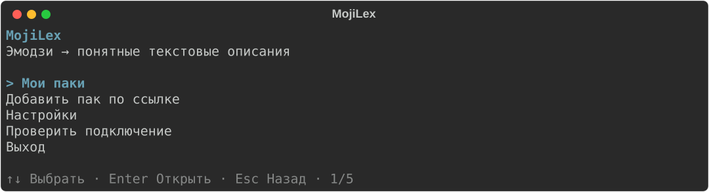
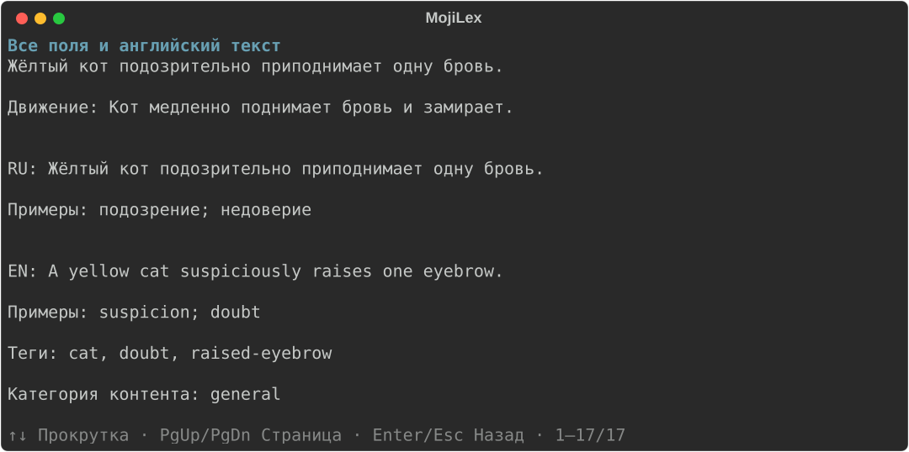

# MojiLex CLI

[English](README.md) | Русский

**Превратите кастомные эмодзи Telegram в понятные описания на русском и английском.**
Добавьте ссылку на пак, дождитесь анализа, посмотрите результат и при желании
отправьте его в [общую базу MojiLex](https://github.com/MojiLex/mojilex).

В программе есть меню со стрелками. Клонировать репозиторий, открывать IDE
и запоминать внутренние идентификаторы запусков не нужно.



[Установка](#быстрый-старт) · [Первый пак](#первый-пак) ·
[Команды](#повседневные-команды) · [Помощь](#вопросы-и-неполадки)

## Поддержка обработки медиа

В Windows и Linux изолированная обработка медиа доступна при успешной проверке
`mojilex doctor`. На версиях macOS, где ядро не позволяет установить точный
жёсткий лимит памяти worker, обработка медиа недоступна: `doctor` сообщает об
ограничении, а декодирование останавливается до создания результата. Программа
не повышает и не отключает лимит автоматически. Команды работы с датасетом
остаются доступны. [Подробности и проверки CI](docs/native-media-platforms.md).

## Быстрый старт

### 1. Установите необходимые инструменты

Потребуются **Git** для установки и работы с базой, **uv** для управления
программой и **GitHub CLI (gh)** для отправки результатов. Для установки нужен интернет.

<details>
<summary><strong>Windows — PowerShell</strong></summary>

Установите [Git](https://git-scm.com/install/windows) и [GitHub CLI](https://cli.github.com/)
через их установщики для Windows. Затем установите [uv](https://docs.astral.sh/uv/getting-started/installation/):

```powershell
powershell -ExecutionPolicy ByPass -c "irm https://astral.sh/uv/install.ps1 | iex"
```

Закройте терминал и откройте новое окно PowerShell.

</details>

<details>
<summary><strong>macOS / Linux</strong></summary>

Установите [Git для вашей ОС](https://git-scm.com/install/) и
[GitHub CLI](https://github.com/cli/cli#installation) по официальным инструкциям.
Затем установите [uv](https://docs.astral.sh/uv/getting-started/installation/):

```sh
curl -LsSf https://astral.sh/uv/install.sh | sh
```

Закройте терминал и откройте новое окно.

</details>

### 2. Установите MojiLex

Эти команды одинаковы для всех поддерживаемых ОС. При необходимости uv установит Python 3.11:

```console
uv tool install --python 3.11 "git+https://github.com/MojiLex/mojilex-cli.git@main"
uv tool update-shell
```

Откройте новый терминал и выполните `mojilex --version` для проверки установки.
Так устанавливается текущая сборка из основной ветки. MojiLex пока находится
на ранней стадии развития; [об ошибках можно сообщить здесь](https://github.com/MojiLex/mojilex-cli/issues).

### 3. Настройте программу один раз

```console
mojilex --ui-language ru init
```

Мастер задаст несколько вопросов:

- Оставьте предложенный локальный путь к базе, `gemini` как провайдера и `ru,en` как языки описаний.
- Укажите точный [ID модели Gemini](https://ai.google.dev/gemini-api/docs/models), доступной вашему аккаунту. Программа не выбирает модель автоматически.
- Можно оставить режим публикации по умолчанию. **Меню всегда анализирует локально** и предлагает отправку отдельно; этот параметр также используется расширенными командами.
- Если мастер спросит автора Git, укажите имя и почту для публикаций или отложите это до отправки.

Уже настроили программу? Используйте `mojilex settings` вместо повторного запуска мастера.

По умолчанию MojiLex автоматически подготавливает локальную копию общей базы
в папке данных программы текущего пользователя. В Windows это
`%LOCALAPPDATA%\MojiLex\mojilex\repository`; сохранённые паки и история запусков
остаются в `%LOCALAPPDATA%\MojiLex\mojilex\runs`. Клонировать базу вручную не нужно,
а стандартный путь не зависит от папки запуска программы. В macOS и Linux
используется системная папка данных приложения для текущего пользователя.
Ранее заданные собственные пути к репозиторию и истории сохраняют приоритет.
Чистая стандартная копия базы обновляется с GitHub перед использованием;
локальные правки, коммиты и вручную выбранные ветки сохраняются.

### 4. Добавьте ключи и проверьте инструменты

| Что понадобится | Где получить | Для чего |
|---|---|---|
| Токен Telegram-бота | [Создать бота через BotFather](https://core.telegram.org/bots/tutorial#obtain-your-bot-token) | Загрузка публичных паков |
| API-ключ Gemini | [Инструкция Google AI Studio](https://ai.google.dev/gemini-api/docs/api-key) | Создание описаний |
| Аккаунт GitHub | `gh auth login` | Отправка результатов; для локального анализа вход не нужен |

Чтобы не вводить ключи каждый раз, сохраните их через скрытый ввод и проверьте инструменты:

```console
mojilex config set-credentials
mojilex doctor
```

Ключи сохраняются в защищённом хранилище операционной системы, а не в Git.
Сохранение необязательно: при анализе программа запросит недостающие значения
на время команды. Сам `init` ключи не запрашивает.

Если `doctor` сообщает о недостающих компонентах, выполните его инструкции.
В Windows он предлагает установку инструментов WebM/TGS; для TGS могут понадобиться
права администратора и объёмная установка Visual Studio Build Tools.
Для Linux/macOS есть [инструкция по медиакомпонентам](docs/media-prerequisites.md) на английском.

## Первый пак

```console
mojilex
```

1. Выберите **Добавить паки по ссылке или из файла** и вставьте публичную ссылку, например `https://t.me/addemoji/NewsEmoji`, или путь к текстовому файлу.
2. Прочитайте план анализа и запрос о стоимости; разрешите запросы, если согласны.
3. После завершения откройте **Мои паки → нужный пак → Посмотреть описания**.
4. Используйте поиск, переключение RU/EN или пункт **Все поля и английский текст**.
   **↑↓ / PgUp / PgDn** прокручивают подробности; **Enter / Esc** возвращают назад.
5. Другой способ просмотра — **Открыть галерею в браузере**.

Меню сохраняет результат локально и не отправляет его автоматически. Просмотр
описаний и галереи не расходует запросы ИИ. Вместо отсутствующих превью показываются заглушки.

Пример подробностей, отрисованный программой на демонстрационных данных:



## Несколько паков из файла

В меню вставьте путь, например `C:\Users\Me\Desktop\packs.txt`. В файле должна
быть одна ссылка на строку (UTF-8). Пустые строки, строки с `#` и повторные ссылки
пропускаются. Все ссылки импортируются в один запуск, затем анализируются вместе:
подтверждать каждую ссылку не нужно. Лимит запросов ИИ общий для запуска и не увеличивается.
В подтверждении стоимости ИИ и отправки выбран ответ **Да**; Enter принимает его.

Для отдельной ссылки и списка ссылок действует настройка **Паки из официального
репозитория** (`mojilex settings`). Список проверяется по основной ветке
`MojiLex/mojilex` один раз на операцию; локальные черновики и открытые PR в него не входят.

| Режим | Поведение |
|---|---|
| `ask` — по умолчанию | Один общий вопрос о найденных паках. **Enter означает Нет**; повторная обработка разрешается только явным ответом «да». Новые паки обрабатываются дальше. |
| `skip` | Найденные официальные паки пропускаются без вопроса. |
| `allow` | Проверка официального списка отключена; действуют обычные правила кэша и повторного анализа. |

Разовый режим можно указать через `--official-packs ask|skip|allow` в командах
`import`, `add`, `describe`, `update` и `resume`. Общий `--yes` не разрешает повтор официальных паков.
В режиме `ask` без интерактивного ввода найденные паки пропускаются.
Если официальный список не удалось проверить, операция останавливается до анализа;
отключить проверку можно только явным выбором `allow`.

Для отправки выберите **Отправить все новые готовые паки на GitHub** или выполните:

```console
mojilex sync --local
mojilex sync
```

Первая команда проверяет общий результат без отправки. Вторая отправляет все
сохранённые готовые паки для настроенного репозитория одним PR после одного подтверждения.
Уже существующие в основной ветке паки пропускаются, опубликованные описания не заменяются.
Пока PR не объединён, паки ещё не считаются добавленными в основную ветку.

Импорт из файла также доступен командой `mojilex import "C:\path\packs.txt"`
или `mojilex import --from-file "C:\path\packs.txt"`. Затем выполните
`mojilex describe RUN_ID` с идентификатором общего импорта из вывода команды.

### Остановка и продолжение большого списка

Импорт и анализ ИИ сохраняются раздельно. После каждого готового медиа сохраняются
его контрольная сумма, результат проверки и подготовленные кадры; готовые ответы ИИ
также сохраняются по мере получения. Остановка не удаляет эти результаты.
Обычная ошибка одного файла не мешает обработать остальные файлы пака.

Чтобы продолжить, откройте **Мои паки → Продолжить** или выполните
`mojilex resume RUN_ID`. Не импортируйте тот же TXT заново: это создаст новый запуск.
Сохранённые корректные кадры используются повторно; при отсутствии или повреждении
кэша файл может быть загружен заново для проверки. Изменившийся источник не подменяет
сохранённые данные молча.

Когда импорт завершится, в его карточке появится **Проанализировать сохранённый
импорт с ИИ**. Продолжение скачивания само по себе не запускает платный анализ.

Для больших списков есть **Настройки → Параллельные паки**: по умолчанию активны
до трёх паков, допустимо от одного до восьми. Скачивание и подготовка одного пака
могут идти одновременно с анализом другого через ИИ. Значение 1 возвращает
последовательную обработку паков. Параметр также доступен как
`processing.pack_concurrency` в TOML или `MOJILEX_PACK_CONCURRENCY` в окружении.

**Параллельные скачивания**, **Параллельные декодеры медиа** и **Параллельные
запросы к ИИ** задают общие пределы для всей операции. Сохранённые лимиты запросов
и стоимости ИИ, а также временного хранилища медиа тоже общие. Увеличение числа
активных паков не умножает эти лимиты. Обновления общих данных репозитория и запись
в Git выполняются последовательно.

По умолчанию одновременно работают два декодера; скачивания могут ждать
свободного декодера без расходования его таймаута. Повышайте число декодеров
постепенно: слишком много процессов может замедлить обработку. Совмещение этапов
уменьшает простои, но ускорение зависит от процессора, сети и квот провайдера.

**Лимит запросов ИИ на всю операцию** общий для всех паков входного файла,
включая повторы, переходы на другую модель и проверки пазлов. По умолчанию это
100 запросов. В **Настройках** введите `unlimited`, чтобы отключить ограничение
количества; `0` запрещает запросы к ИИ. Лимит стоимости и квоты провайдера
продолжают действовать. В TOML используется `max_ai_requests = "unlimited"` в
секции `[ai]`, в окружении — `MOJILEX_MAX_AI_REQUESTS=unlimited`.
У сохранённого запуска остаётся его бюджет, пока вы явно не измените его:

```console
mojilex resume RUN_ID --max-ai-requests unlimited
```

Такой же параметр есть у `add` и `describe`. Числовое значение задаёт общий бюджет
запуска с учётом уже выполненных запросов, а не дополнительное количество.

## Повседневные команды

После анализа программа дополнительно ищет связанные фрагменты изображений внутри
пака. Проверяются статичные неперекрашиваемые квадратные эмодзи: сетки и полосы,
включая 2×1 и 1×2, до 8 частей по каждой оси и до 24 в сборке. Поиск в двух
масштабах учитывает связи между частями, шум и частично прозрачные края.
Затем нужны три согласованных AI-проверки: непрерывность рисунка, отсутствие
самостоятельных иконок и правильность расположения. Отказ любой проверки
отклоняет вариант. Дополнительно проверяется объединение уже найденных полос
по нескольким стыкам общей границы: например, кроны и ствола дерева. Прежние
подтверждённые группы заменяются только после успешной проверки большей сборки,
с сохранением всех частей и их взаимного расположения. При отказе они остаются.
Поиск оставляет не более трёх вариантов на эмодзи (до девяти
AI-запросов в одном паке). Если эмодзи повторяется в разных паках, действует
общий предел 10 запросов на `native_id` за массовую проверку. Принятые группы
внутри пака не пересекаются. Проверка использует оставшийся
общий бюджет после описаний всех паков, без новых подтверждений;
при сомнении, ошибке или недостатке бюджета группа не помечается.

Проверенные группы видны отдельным разделом галереи и в `show --json` как
`compositions`. У подтверждённых участников в публичном `semantic_tags` появляется служебная
метка `fragment`, которая также попадает в GitHub и поисковый экспорт. Приложение
может показать: «Фрагмент составной картинки; не обязательно самостоятельный эмодзи».
Метка требует всех трёх проверок; обычный ответ ИИ об одной картинке её не добавляет. Полнота сборки не гарантируется:
крайние или неоднозначные фрагменты могут быть пропущены. Старые сохранённые превью
без исходных RGBA-тайлов пропускаются; при изменении медиа прежнее подтверждение
не используется. Это консервативная проверка, а не гарантия отсутствия ошибок.

В локальном checkpoint группы находятся в
`safe_parameters.composition_evidence[имя_пака]`. `detector: "composition-v3"`
обозначает версию поиска, `verified: true` и `verification_passes: 3` — прохождение
всех проверок; `verifier_model` содержит модель. Проверенные группы v2 можно
сохранить при совпадении модели, всех хешей и трёх проверок. `columns` и `rows` задают сетку,
а `members` перечисляет части слева направо, сверху вниз. Каждая часть содержит
`native_id`, хеш оригинала `media_sha256` и хеш RGBA-тайла `tile_sha256`.
В публичной схеме принадлежность к пазлу обозначается тегом `fragment`.
Отсутствие метки не доказывает самостоятельность эмодзи. Запись сохраняет 1–12
обычных тегов и дополнительный `fragment` (до 13 всего); приложения со старым
ограничением в 12 тегов должны обновить схемы. Обычные буквы и цифры
не становятся пазлами только потому, что стоят рядом. Сведения о группах пока
не экспортируются в GitHub-датасет: публичной становится только метка.
При отправке или синхронизации ранее сохранённых подтверждённых паков метка
добавляется без новых запросов к ИИ. Синхронизация по-прежнему пропускает уже
опубликованные паки и сохраняет существующие общие записи эмодзи. Ранее
опубликованная метка сохраняется при неизменном оригинале; изменившееся медиа
требует нового подтверждения. Добавление метки сбрасывает прежнее ручное
одобрение точного содержимого записи; отрицательное ручное решение
автоматически не меняется.
В старых черновиках свободное AI-слово `fragment` не считается подтверждением
пазла: собственные результаты старого запуска нормализуются по сохранённым
подтверждениям. Если старая схема черновика не допускает тринадцатый тег, анализ
сохраняет все обычные теги, а метка добавляется при публикации через обновлённую
схему репозитория.

Замените `NewsEmoji` названием своего пака. Эти команды работают с **вашими локально
сохранёнными паками**, а не со всеми паками Telegram или GitHub.

| Что нужно сделать | Команда |
|---|---|
| Открыть меню | `mojilex` |
| Посмотреть свои паки и прогресс | `mojilex list` |
| Прочитать описания | `mojilex show NewsEmoji` |
| Открыть галерею в браузере | `mojilex gallery NewsEmoji` |
| Напечатать все поля | `mojilex show NewsEmoji --all` |
| Продолжить незавершённую работу | `mojilex resume NewsEmoji` |
| Проверить черновик без отправки | `mojilex publish NewsEmoji --local` |
| Отправить результат через PR на GitHub | `mojilex publish NewsEmoji` |
| Изменить модель, лимиты или параллельность | `mojilex settings` |
| Проверить инструменты и доступ | `mojilex doctor` |

Для нового пака через команды выполните `mojilex import "PACK_URL"`, затем
`mojilex describe PACK_NAME`. Замените заглушки своей ссылкой и названием пака.
Так анализ и публикация остаются отдельными действиями.

## Отправка на GitHub

Один раз войдите в аккаунт, затем отправьте готовый пак:

```console
gh auth login
mojilex publish NewsEmoji
```

MojiLex проверит описания, подготовит коммит, загрузит ветку и создаст или обновит
**Pull Request (PR)** — предложение добавить данные в общую базу. Во время работы
видны текущий этап и время ожидания. Повторный анализ не запускается.

Откройте полученную ссылку на PR и вкладку **Checks**. Зелёные проверки означают,
что проверка пройдена; в основной базе пак появится только после **объединения PR (merge)**.
Успешная отправка или сохранённая попытка публикации не означают, что PR уже принят.

Предупреждения о содержимом остаются в записях. Они не требуют ручного одобрения
и не блокируют отправку; некорректные данные по-прежнему не проходят проверку.

## Вопросы и неполадки

| Вопрос | Что делать или учитывать |
|---|---|
| Анализ платный? | Может быть платным: стоимость зависит от аккаунта Gemini и модели. По умолчанию лимит — **100 запросов на запуск**, включая повторы. После прерывания расход сохраняется. Перед согласием на неизвестную стоимость проверьте план. |
| Как ускорить? | **Настройки → Параллельные паки** совмещает работу над несколькими паками в пределах общих лимитов скачиваний, декодеров и ИИ. Эти лимиты настраиваются отдельно под компьютер и провайдера. Для существующего запуска `mojilex resume NewsEmoji --ai-concurrency 4` меняет параллельность ИИ без увеличения бюджета запросов. |
| Пропал интернет или я остановил обработку | Выполните `mojilex resume NewsEmoji`. Готовая работа используется повторно; отсутствующие или повреждённые медиа могут скачаться заново. Ошибки лимита или доступа сначала нужно устранить. |
| Почему счётчик не движется? | Пачка может ожидать ответ или его проверку. Смотрите на этап, повторы и время ожидания. Прошедшее время не означает завершённую обработку. |
| Где английские описания? | Переключите язык в `show` или откройте подробности эмодзи. Язык интерфейса меняется отдельно — в **Настройках**. |
| Команда не найдена | Выполните `uv tool update-shell` и откройте новый терминал. |
| Где мой результат? | Откройте `mojilex list` и `mojilex show NewsEmoji`. Локальный черновик, публикация на GitHub и снимок базы — разные результаты. |
| Другая ошибка повторяется | Выполните `mojilex doctor`; загляните в [справочник ошибок](docs/error-reference.md) на английском. Сообщите команду и код ошибки, без ключей и чувствительных логов. |

## Обновление и удаление

Если программа установлена командами выше:

```console
uv tool upgrade mojilex-cli
```

После обновления перезапустите `mojilex`. Настройки и сохранённые запуски сохраняются.
`mojilex uninstall` сначала покажет план удаления и запросит подтверждение.
`mojilex uninstall --keep-data` сохраняет настройки, запуски, кеш и ключи.

## Подробная документация

- [Расширенное использование](docs/advanced-usage_RU.md): параметры, повторы, конфигурация, снимки базы и совместимость.
- [Разработка](docs/development_RU.md): исходники, тесты и сборка.
- На английском: [медиакомпоненты](docs/media-prerequisites.md) · [правила публикации](docs/publishing.md) · [модель безопасности](docs/security-model.md).
- [Как внести вклад](CONTRIBUTING.md) (на английском) · [Сообщить об ошибке](https://github.com/MojiLex/mojilex-cli/issues).

Кадры могут сохраняться **локально** для продолжения и превью. Исходные медиа,
кадры и API-ключи никогда не отправляются в репозиторий данных.
Код CLI распространяется по [MIT](LICENSE); лицензии описаний и данных указаны
в [репозитории базы](https://github.com/MojiLex/mojilex).
